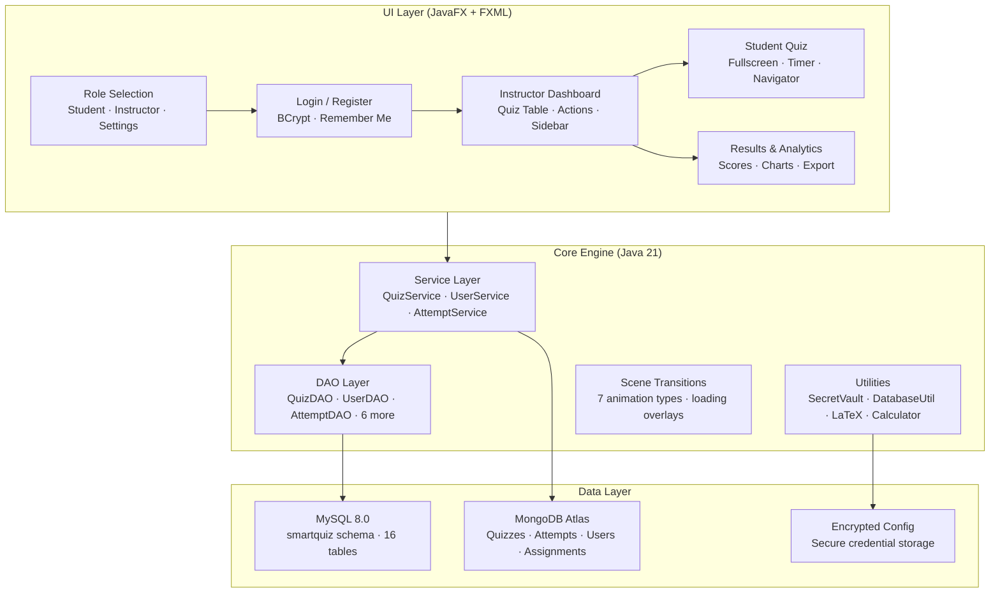
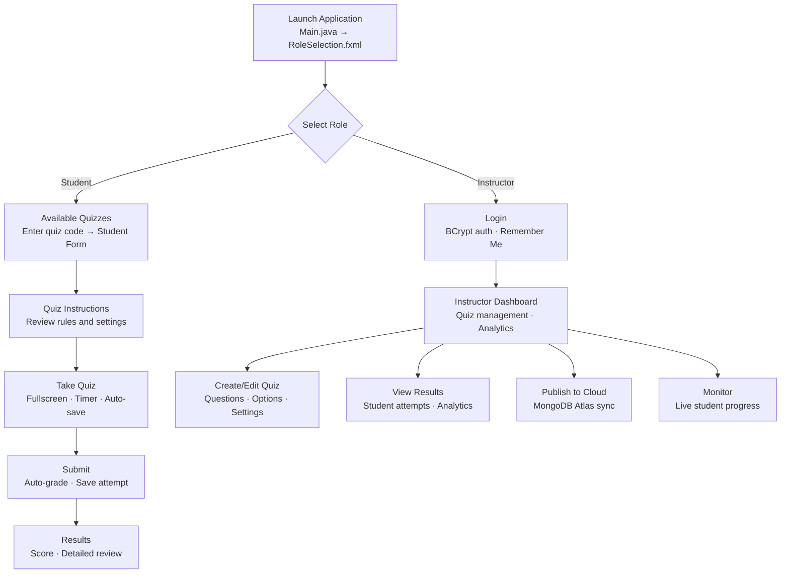

<p align="center">
  
</p>
<h1 align="center">PrashnaSetu</h1>
<p align="center">
  <strong>A secure, feature-rich quiz management system for academic institutions</strong><br/>
  <em>Create quizzes, conduct proctored exams, grade automatically, and publish results — all from a single desktop application</em>
</p>

<p align="center">
  
  
  
  
  
  
</p>

---

## 📋 Table of Contents

- [Overview](#-overview)
- [Why PrashnaSetu?](#-why-prashnasetu)
- [Features](#-features)
- [Architecture](#-architecture)
- [Application Flow](#-application-flow)
- [Getting Started](#-getting-started)
- [Configuration](#-configuration)
- [Database Schema](#-database-schema)
- [Security](#-security)
- [Roadmap](#-roadmap)
- [Authors](#-authors)

---

## 🔍 Overview

**PrashnaSetu** (Hindi: प्रश्नासेतु — *"Bridge of Questions"*) is a Java-based desktop application that lets instructors create, manage, and conduct quizzes with robust proctoring, automated grading, and cloud publishing. Students take quizzes through a fullscreen proctored interface with randomized questions, anti-cheat monitoring, and real-time state persistence. Results can be published to a MongoDB Atlas backend for consumption by the companion [PrashnaSetu Web Portal](https://prashnasetu.vercel.app/).

The application supports three user roles — **Admin**, **Instructor**, and **Proctor** — with role-based access control, and handles all data through a MySQL database with encrypted configuration.

> **PrashnaSetu is closed-source software.** The source code is private. Pre-built executables are available for download from the [Releases](https://github.com/Felix-au/PrashnaSetu-Public/releases) page.

---

## 🎯 Why PrashnaSetu?

> **Most exam platforms are cloud-only SaaS products that require constant internet, subscriptions, and send student data to third-party servers. PrashnaSetu runs locally with your own database.**

| | Cloud Exam Platforms | PrashnaSetu |
|---|---|---|
| **Hosting** | Vendor cloud — recurring subscription | Your MySQL server — one-time setup |
| **Data Ownership** | Vendor stores student data | All data stays on your infrastructure |
| **Internet** | Required at all times | Only needed for cloud publish (optional) |
| **Proctoring** | Requires browser plugins or webcam | Built-in fullscreen monitoring with fault tracking |
| **Question Types** | Varies by plan | MCQ + Fill-in-the-Blank with LaTeX rendering |
| **Cost** | Per-student pricing | Free to use |
| **Custom Branding** | Limited or premium tier | Fully configurable for your institution |

---

## ✨ Features

### 👥 User Management
| Feature | Description |
|---|---|
| **Role-Based Access** | Three roles: Admin (full control), Instructor (quiz management), Proctor (monitoring only) |
| **Secure Authentication** | BCrypt password hashing with migration support for legacy passwords |
| **Remember Me** | Encrypted credential store with fuzzy username suggestions |
| **Registration Codes** | Role-specific registration codes prevent unauthorized signups |
| **Login Audit Trail** | IP-stamped login logs for Admin/Instructor/Proctor sessions |

### 📝 Quiz Creation & Management
| Feature | Description |
|---|---|
| **Quiz Builder** | Create quizzes with metadata: course, year, subject, subject code, academic year |
| **Two Question Types** | Multiple Choice (single/multi-correct) and Fill-in-the-Blank with multiple accepted answers |
| **LaTeX Support** | Full mathematical expression rendering via JLaTeXMath — inline `\(...\)` and block `\[...\]` |
| **Image Questions** | Attach images to questions (stored as BLOB or uploaded to ImgBB for cloud) |
| **Question Distribution** | Configure how many easy/medium/hard questions each student sees |
| **Import/Export** | Import quizzes from Excel (Apache POI) and export to CSV |
| **Quiz Assignments** | Assign specific quizzes to instructors for delegation |

### 🎓 Student Quiz Experience
| Feature | Description |
|---|---|
| **Randomized Questions** | Deterministic per-student randomization using SHA-256 seeded shuffle |
| **Fullscreen Proctoring** | Monitors fullscreen state and window focus — tracks fault count |
| **Dark Mode** | Toggle between light and dark themes during the quiz |
| **Scientific Calculator** | Built-in calculator powered by EvalEx for math-heavy exams |
| **Timer** | Countdown timer with 1-minute and 30-second warnings |
| **Auto-Save** | Periodic state persistence — answers, current question, remaining time |
| **Resume Support** | Students can resume interrupted attempts with saved question order |
| **Navigation Grid** | Color-coded question navigator with difficulty indicators |
| **Mark for Review** | Flag questions for revisiting before final submission |
| **Internet Monitoring** | Detects connectivity issues and blocks quiz during outages |

### 📊 Results & Analytics
| Feature | Description |
|---|---|
| **Auto-Grading** | Automatic scoring with partial and negative marking options |
| **Recalculate Marks** | Bulk recalculation if answer keys change after submission |
| **Question-Wise Analysis** | Per-question statistics: correct rate, difficulty distribution, common wrong answers |
| **Performance Stats** | Student performance breakdown by difficulty tier (easy/medium/hard) |
| **Student Time Allotment** | Track time spent per student per quiz |
| **Publish Control** | Configure result visibility: marks-only or detailed, with optional expiry date |

### ☁️ Cloud Publishing (MongoDB Atlas)
| Feature | Description |
|---|---|
| **One-Click Publish** | Push quiz data, student attempts, and assignments to MongoDB Atlas |
| **Image Hosting** | Auto-uploads question images to ImgBB with CDN URLs |
| **User Sync** | Syncs instructor/proctor accounts to cloud for web portal auth |
| **Quiz Assignments** | Publishes per-quiz email assignment arrays for access control |
| **Web Portal** | Published data powers the [PrashnaSetu Web Portal](https://prashnasetu.vercel.app/) for student result access |

### 🔄 Auto-Update System
| Feature | Description |
|---|---|
| **Dual Update Sources** | Checks both GitHub Releases (online) and local database (LAN) for updates |
| **Auto-Update** | 10-second countdown dialog with automatic download and install |
| **PowerShell Updater** | Graceful EXE swap with backup and automatic relaunch |

### 🖥️ UI & Navigation
| Feature | Description |
|---|---|
| **Smooth Transitions** | 7 transition types (Fade, Slide, Scale) with automatic loading overlays |
| **Paginated Dashboard** | Dynamic quiz table with search, multi-field filtering, and sort controls |
| **Ikonli Icons** | FontAwesome 5 vector icons throughout the interface |
| **IP Access Control** | Restrict quiz access to specific IP ranges |
| **Student Directory** | Bulk import student data from CSV with delta-sync support |
| **PDF Reports** | Export student results and quiz analytics as formatted PDF documents |

---

## 🏗 Architecture



<details>
<summary>ASCII fallback (click to expand)</summary>

```
┌──────────────────────────────────────────────────────────────────────┐
│                        UI Layer (JavaFX + FXML)                      │
│                                                                      │
│  ┌──────────────┐  ┌──────────────┐  ┌──────────────┐                │
│  │ Role         │  │ Login /      │  │ Instructor   │                │
│  │ Selection    ├─►│ Register     ├─►│ Dashboard    │                │
│  │              │  │ BCrypt       │  │ Quiz Table   │                │
│  └──────────────┘  └──────────────┘  └──────┬───────┘                │
│                                        ┌────┴────┐                   │
│                                   ┌────┴──┐  ┌───┴────┐              │
│                                   │Student│  │Results │              │
│                                   │ Quiz  │  │& Analy-│              │
│                                   │       │  │tics    │              │
│                                   └───────┘  └────────┘              │
└────────────────────────────┬─────────────────────────────────────────┘
                             │
                             ▼
┌──────────────────────────────────────────────────────────────────────┐
│                      Core Engine (Java 21)                           │
│                                                                      │
│  ┌──────────────┐  ┌──────────────┐  ┌──────────────┐                │
│  │ Service Layer│  │ DAO Layer    │  │ Utilities    │                │
│  │ QuizService  │  │ QuizDAO      │  │ SecretVault  │                │
│  │ UserService  │  │ UserDAO      │  │ DatabaseUtil │                │
│  │ AttemptSvc   │  │ AttemptDAO   │  │ LaTeX, Calc  │                │
│  └──────┬───────┘  └──────┬───────┘  └──────┬───────┘                │
│         │                 │                 │                        │
│  ┌──────┴─────────────────┴─────────────────┴───────┐                │
│  │            Scene Transitions (7 types)           │                │
│  └──────────────────────────────────────────────────┘                │
└────────────────────────────┬─────────────────────────────────────────┘
                             │
                             ▼
┌──────────────────────────────────────────────────────────────────────┐
│                         Data Layer                                   │
│                                                                      │
│  ┌──────────────┐  ┌──────────────┐  ┌──────────────────┐            │
│  │ MySQL 8.0    │  │ MongoDB Atlas│  │ Encrypted Config │            │
│  │ smartquiz    │  │ Quizzes      │  │ Secure credential│            │
│  │ 16 tables    │  │ Attempts     │  │ storage          │            │
│  │              │  │ Users        │  │                  │            │
│  └──────────────┘  └──────────────┘  └──────────────────┘            │
└──────────────────────────────────────────────────────────────────────┘
```

</details>

---

## 🔄 Application Flow



<details>
<summary>ASCII fallback (click to expand)</summary>

```
Launch Application
      │
      ▼
┌─ Select Role ────────────────────────────────────┐
│                                                  │
├──► Student                ├──► Instructor        │
│    │                      │    │                 │
│    ▼                      │    ▼                 │
│    Available Quizzes      │    Login             │
│    Enter quiz code        │    BCrypt auth       │
│    │                      │    │                 │
│    ▼                      │    ▼                 │
│    Quiz Instructions      │    Dashboard         │
│    Review rules           │    ├──► Create/Edit  │
│    │                      │    ├──► View Results │
│    ▼                      │    ├──► Publish      │
│    Take Quiz              │    └──► Monitor      │
│    Fullscreen, Timer      │                      │
│    │                      │                      │
│    ▼                      │                      │
│    Submit → Auto-grade    │                      │
│    │                      │                      │
│    ▼                      │                      │
│    Results                │                      │
└───────────────────────────┴──────────────────────┘
```

</details>

---

## 🚀 Getting Started

### Download

Get the latest release from the [PrashnaSetu Releases](https://github.com/Felix-au/PrashnaSetu-Public/releases) page.

Each release includes:
- `PrashnaSetu.exe` — the main application executable

### Prerequisites

- **Windows 10/11**
- **MySQL 8.0+** — the application requires a MySQL database for all data storage
- **JRE (Java Runtime)** — a `jre/` folder must be present at the same level as the EXE
- **OpenJFX SDK** — an `openjfx/` folder must be present at the same level as the EXE

### Directory Structure

```
PrashnaSetu/
├── PrashnaSetu.exe          # Application executable
├── jre/                     # Java Runtime Environment (required)
└── openjfx/                 # OpenJFX SDK (required)
```

> **⚠️ Important:** The `jre/` and `openjfx/` folders must be placed in the same directory as `PrashnaSetu.exe` for the application to launch. These provide the Java runtime and JavaFX libraries respectively.

### Database Setup

```sql
-- 1. Run the schema script to create the database and tables
SOURCE sql/schema.sql;

-- 2. This creates:
--    • smartquiz database with 16 tables
--    • Default admin user (admin / admin123)
--    • Default registration codes
```

### Launch

```
Double-click PrashnaSetu.exe
```

On launch, the **Role Selection** screen appears with Student and Instructor entry points, the current version, and an update status banner.

### Default Login

| Username | Password | Role |
|---|---|---|
| `admin` | `admin123` | Admin (full access) |

---

## ⚙️ Configuration

### Environment Variables

The application reads configuration from an encrypted properties file at runtime. Key configuration areas include:

| Category | Description |
|---|---|
| **Database** | MySQL connection string, credentials, and driver class |
| **Application** | Version string, executable name, static server port |
| **Auto-Update** | GitHub Releases API endpoint for update checking |
| **MongoDB** | Atlas connection string, database name, and collection names |
| **ImgBB** | API key for question image CDN hosting |

### SQL Connection Dialog

PrashnaSetu includes a built-in SQL Connection Dialog accessible from the Role Selection screen. This lets you switch database servers at runtime without editing config files. Session overrides are temporary — they reset when the app restarts.

---

## 🗄️ Database Schema

The application uses a MySQL database (`smartquiz`) with 16 tables:

| Table | Purpose |
|---|---|
| `users` | User accounts (Admin, Instructor, Proctor) with BCrypt hashes |
| `quizzes` | Quiz metadata, settings, and configuration flags |
| `questions` | Question text, images, difficulty, subject, type |
| `options` | Multiple-choice options with correct flag |
| `question_blanks` | Fill-in-the-blank accepted answers (JSON array) |
| `quiz_instructions` | Ordered instruction text per quiz |
| `quiz_attempts` | Student attempt records with scores and timestamps |
| `student_answers` | Selected options per question per attempt |
| `student_blank_answers` | FIB text answers per blank per attempt |
| `quiz_assignments` | Quiz-to-instructor assignment mappings |
| `publish_state` | Result visibility and publish settings per quiz |
| `remember_me_tokens` | Persistent login tokens |
| `current_ip` | Server IP tracking for LAN features |
| `app_release` | Single-row EXE storage for LAN auto-update (LONGBLOB) |
| `registration_codes` | Role-specific registration codes |
| `login_logs` | Audit trail for instructor/admin logins |

---

## 🔒 Security

### Configuration Security
- All sensitive configuration (database credentials, API keys, cloud URIs) is stored in an **encrypted properties file**.
- The encryption key is assembled from **multiple fragments** spread across different internal classes, making extraction from the binary non-trivial.
- After ProGuard obfuscation, fragment accessor methods are renamed to Unicode lookalike identifiers for enhanced protection.

### Password Security
- All passwords are hashed with **BCrypt** (cost factor 10).
- Legacy plaintext passwords are supported for migration but new accounts always use hashes.

### Quiz Proctoring
- **Fullscreen monitoring** with fault counting.
- **Window focus tracking** — detects alt-tab or window switching.
- **IP restriction** — quizzes can be locked to specific IP ranges.
- **Quiz passwords** — optional 6-character passwords for quiz access.
- **Internet monitoring** — blocks quiz progression during connectivity loss.

---

## 🗺️ Roadmap

### Completed Features ✅

| Feature | Description |
|---|---|
| **Web Portal Integration** | Full sync with [PrashnaSetu Web Portal](https://prashnasetu.vercel.app/) for student result access |
| **PDF Report Generation** | Export student results and quiz analytics as PDF reports |
| **Collaborative Quiz Creation** | Multiple instructors can work on quizzes via quiz assignment delegation |

### Planned Features

| Feature | Description | Status |
|---|---|---|
| **Enhanced Analytics** | Per-topic performance breakdown and difficulty calibration | 🔜 Next |

### Future Ideas

- **Webcam Proctoring** — face detection and identity verification during exams
- **Question Bank** — shared question repository across quizzes with tagging
- **Multi-Language Support** — UI localization for Hindi, regional languages
- **Mobile Companion** — Android app for student quiz access

---

## 👤 Authors

**Felix-au** (Harshit Soni)

- 🔗 GitHub: [github.com/Felix-au](https://github.com/Felix-au)

**SharmaKiran** (Kiran Sharma)

- 🔗 GitHub: [github.com/SharmaKiran](https://github.com/SharmaKiran)

---

<p align="center">
  <sub>PrashnaSetu — प्रश्नासेतु — Bridging questions to knowledge.</sub>
</p>
